<div align="center">

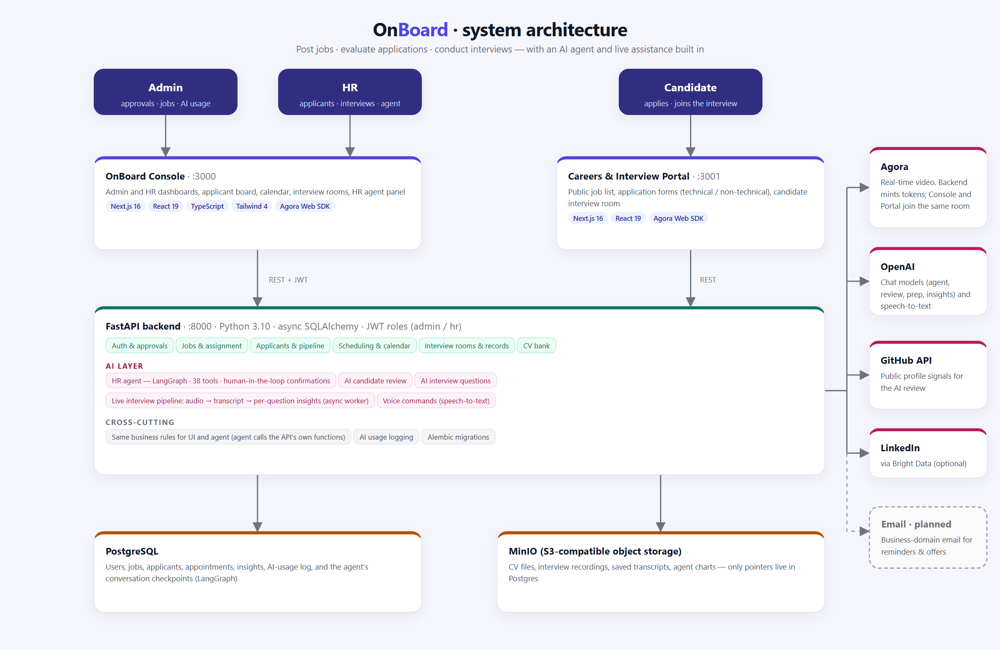

# OnBoard

**Simplify posting jobs, evaluating applications and conducting interviews.**<br>
An employee onboarding & recruitment platform — **Version 1**

</div>

---

## The objective

Hiring is a chain of small, repetitive jobs: write the posting, collect applications, read CVs, move people between
stages, find a slot, run the interview, remember what was said, decide. OnBoard puts that whole chain in one place and
lets AI take the tedious parts — without ever taking the decision away from a person.

- **Post a job once**, assign it to an HR owner, and get a public application form for it automatically.
- **Evaluate applications faster** with a clear applicant board, HR ratings, and an optional, explained AI review.
- **Run interviews inside the app**: scheduling, video room, recording, live transcript, notes and a permanent interview record.
- **Ask an AI agent** to do the busywork ("book all three on Tuesday", "show me Daniyal's CV", "chart my pipeline"), by text or by voice.
- **Get live help in the interview** — the AI judges each answer as it happens and suggests where to dig deeper.

> AI in OnBoard is always a *recommendation*. Scores, insights and agent actions never decide for HR: changes go through a
> confirmation card, and the candidate is warned whenever their voice is analysed.

## Contents

1. [Admin and HR](#1-admin-and-hr)
2. [Creating jobs and assigning them to HR](#2-creating-jobs-and-assigning-them-to-hr)
3. [Application forms and flows: technical vs non-technical](#3-application-forms-and-flows-technical-vs-non-technical)
4. [The applicant dashboard](#4-the-applicant-dashboard)
5. [Interviews inside the application](#5-interviews-inside-the-application)
6. [Scheduling, calendars and notifications](#6-scheduling-calendars-and-notifications)
7. [The HR agent](#7-the-hr-agent)
8. [Live interview assistance](#8-live-interview-assistance)
9. [AI features: candidate review and interview prep](#9-ai-features-candidate-review-and-interview-prep)
10. [Technology: frameworks, models, databases](#10-technology-frameworks-models-databases)
11. [Getting started](#11-getting-started)
12. [Repository layout, videos and roadmap](#12-repository-layout-videos-and-roadmap)

---

## 1. Admin and HR

OnBoard has two roles.

| | **Admin** | **HR** |
|---|---|---|
| Gets an account by | Being created in the database (the first one) | Requesting access on the sign-up page, then **approved by an admin** |
| Manages | HR accounts, approvals, all jobs, who owns which job | Only the jobs assigned to them, and everything under those jobs |
| Sees | Every job and applicant (read-only), interview records, **AI usage** | Their applicants, interviews, calendar, CV bank, the HR agent |

New accounts cannot sign in until an admin approves them — the request, the decision and who made it are all recorded
in the approval history.

<table>
<tr>
<td width="50%">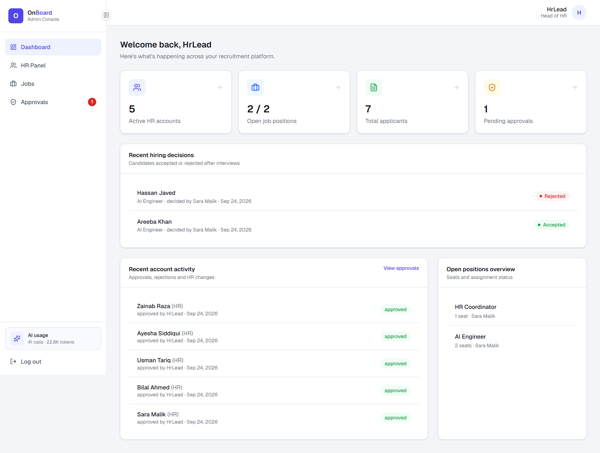<br><sub><b>Admin dashboard</b> — accounts, jobs and recent activity at a glance.</sub></td>
<td width="50%">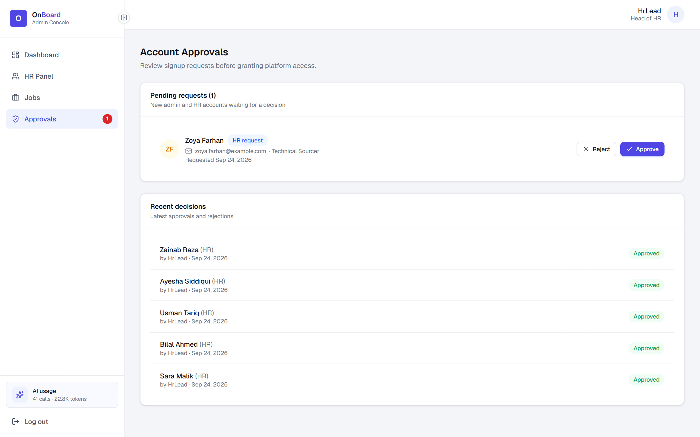<br><sub><b>Approvals</b> — pending requests, Approve / Reject, and a history of recent decisions.</sub></td>
</tr>
</table>

### Admins can see AI usage

Every OpenAI call the platform makes — reviews, interview prep, live transcription and analysis — is logged with its model,
purpose and token count, so cost is never a surprise. Admins open the **AI usage** panel from the sidebar.

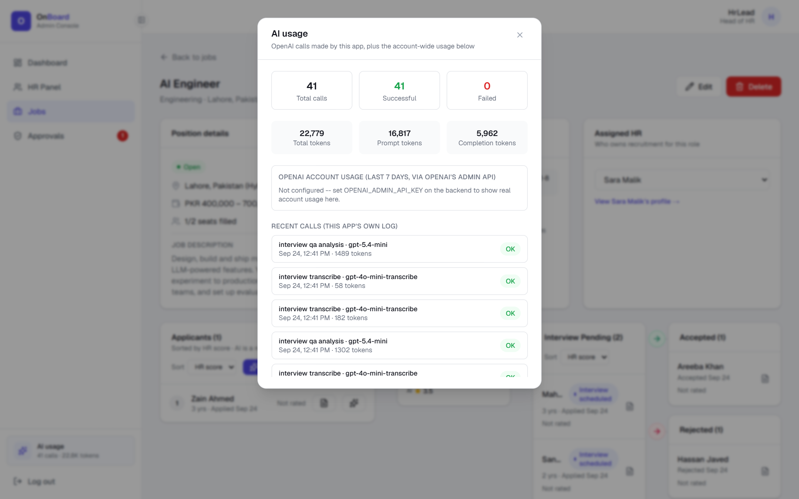

> The panel can also show account-wide usage from OpenAI's Admin API once an `OPENAI_ADMIN_API_KEY` is configured.

---

## 2. Creating jobs and assigning them to HR

Admins post a job (title, department, location, description, seats, salary range, currency, status) and mark whether it
is a **technical role**. Each job is then assigned to one HR, who owns the recruitment for it from that point on.
Every job automatically gets a **public application form** with a shareable link.

<table>
<tr>
<td width="50%">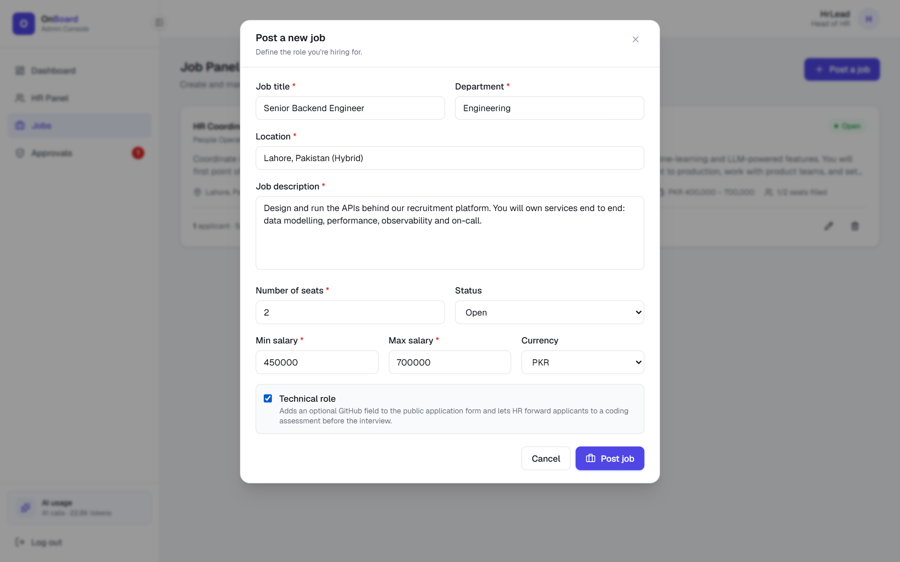<br><sub><b>Post a job</b> — including the "Technical role" switch that changes the form and the flow.</sub></td>
<td width="50%">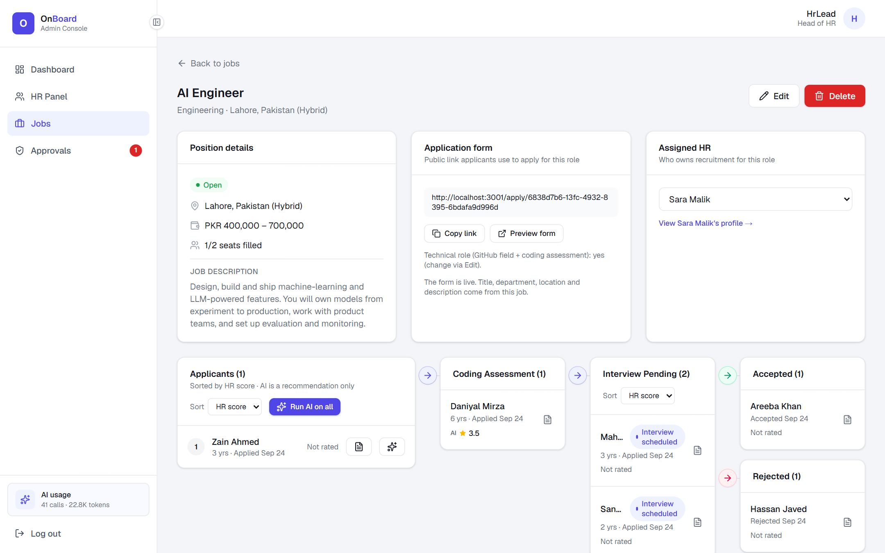<br><sub><b>Assign an HR</b> — pick the owner; the public application link and applicant board live on the same page.</sub></td>
</tr>
</table>

Jobs close automatically when every seat is filled, and closed jobs show "Applications closed" on the public form.

---

## 3. Application forms and flows: technical vs non-technical

The **technical role** switch on a job changes two things.

**The form.** Technical jobs add a GitHub profile field. Non-technical jobs don't. Every form takes contact details,
years of experience, an optional LinkedIn link and cover letter, and a CV upload (PDF, Word or text, up to 10 MB).

<table>
<tr>
<td width="50%" valign="top">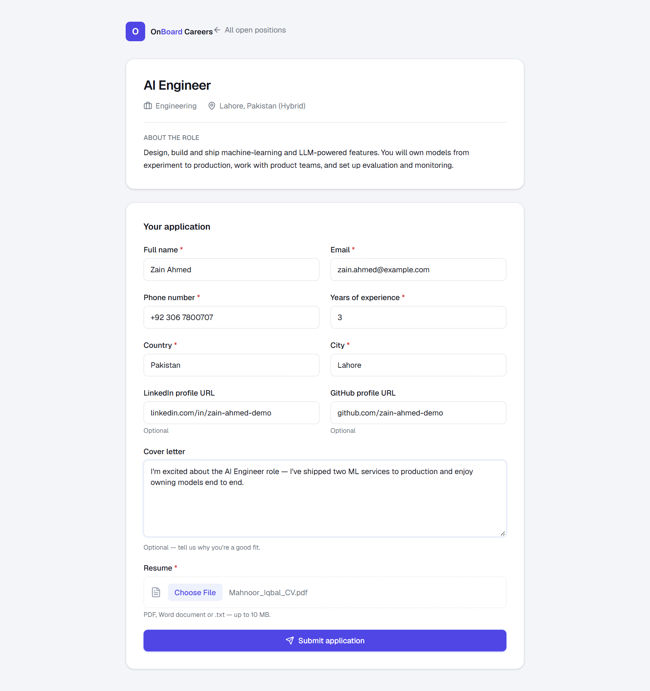<br><sub><b>Technical role</b> (AI Engineer) — includes the GitHub field.</sub></td>
<td width="50%" valign="top">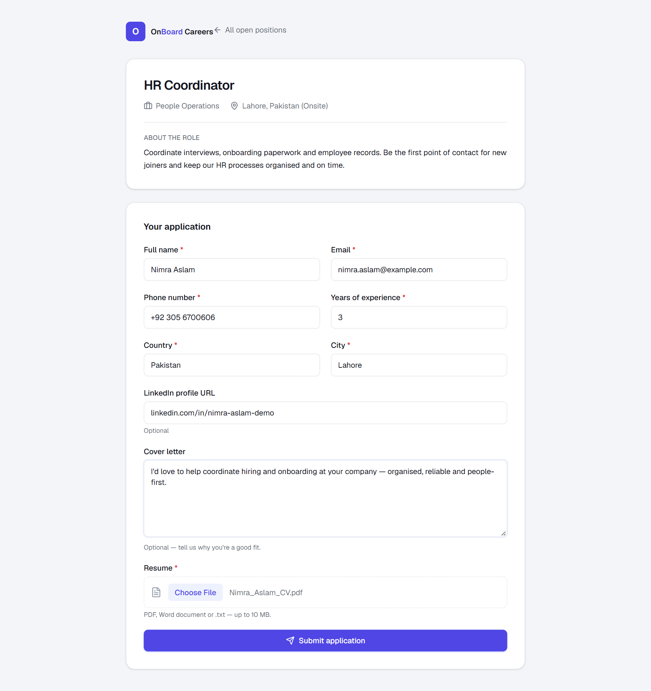<br><sub><b>Non-technical role</b> (HR Coordinator) — no GitHub field.</sub></td>
</tr>
</table>

**The flow.** Technical roles can send an applicant to a **coding assessment** before the interview; non-technical roles go
straight to interview.

<table>
<tr>
<td width="50%" valign="top">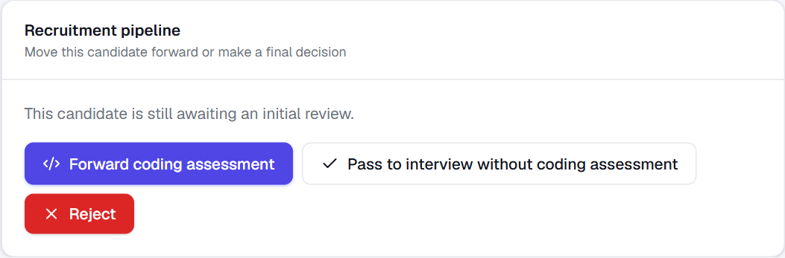<br><sub><b>Technical:</b> Applied → <i>Coding assessment</i> → Interview pending → Interview scheduled → Accepted / Rejected. HR can also skip the assessment.</sub></td>
<td width="50%" valign="top">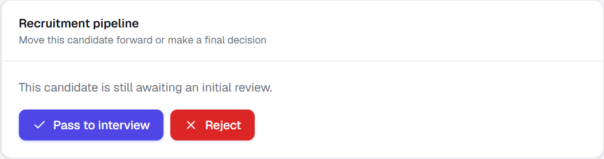<br><sub><b>Non-technical:</b> Applied → Interview pending → Interview scheduled → Accepted / Rejected.</sub></td>
</tr>
</table>

---

## 4. The applicant dashboard

HR's home page shows what needs attention: assigned jobs, open seats, upcoming interviews and candidates waiting to be
scheduled.

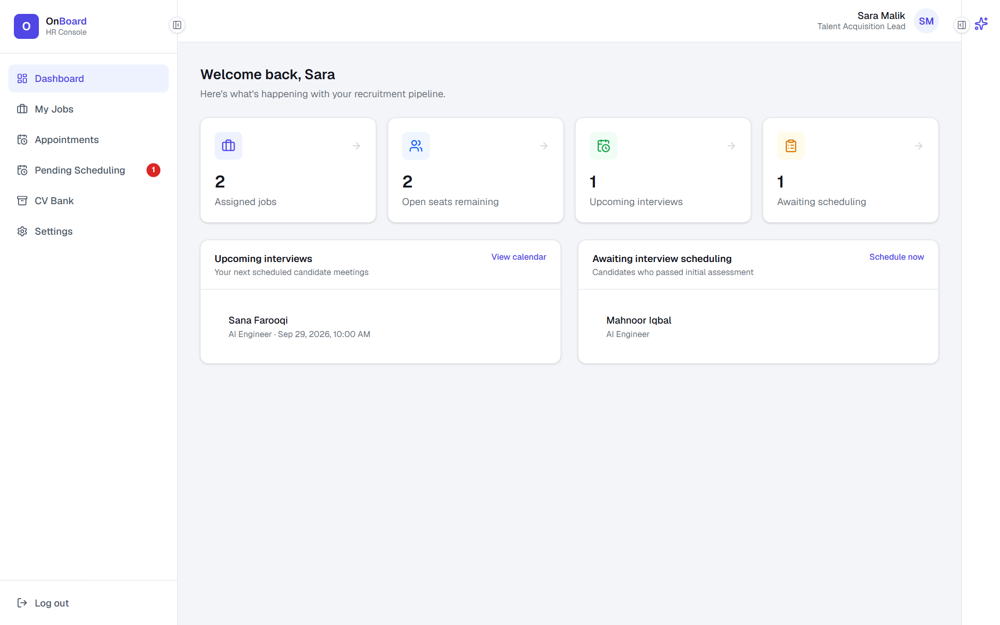

Each job has an **applicant board** with one column per stage. It is built for fast decisions:

- Applicants ranked by **HR score** or **AI score** (the AI order is only a suggestion — HR can rank manually with up/down arrows).
- **Bulk actions**: select several applicants and pass them to the coding assessment, pass them to interview, or reject them.
- **View a CV** in place, run the **AI review** for one or all applicants, and schedule an interview straight from a card.
- Long columns scroll inside their box, so the page stays compact.

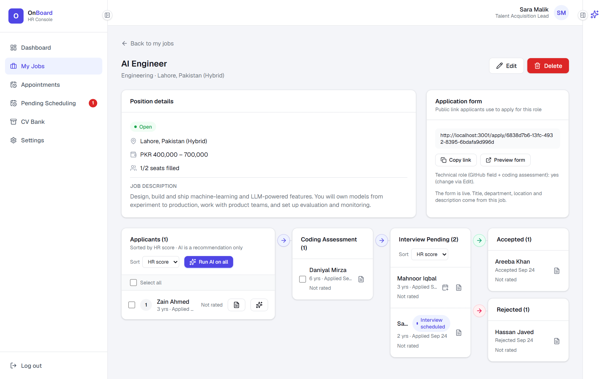

An applicant's own page holds their details, HR star rating (half-star steps) and notes, the AI review, the recruitment
pipeline actions, and a menu of all their interviews. Rejected candidates can be kept in a shared **CV bank** for future roles.

---

## 5. Interviews inside the application

Interviews happen in the browser — no separate meeting tool. HR sets up a room for an interview, shares the candidate's
private link, and starts the room when ready. The candidate can only join once HR has started it.

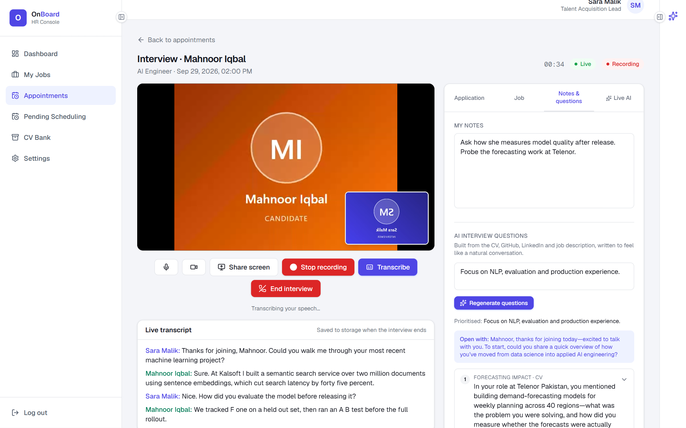

In the room, HR gets:

- **Video** with camera, microphone and screen sharing (Agora), and a live **transcript** of both speakers.
- **Record video** — chosen before the call; the candidate is told on their join screen and sees a "being recorded" banner. The recording is saved when the interview ends.
- A side panel with the candidate's **application**, the **job**, **notes & AI questions**, and **Live AI** (section 8).
- **End interview** — HR writes their overall impression, and everything is saved.

Afterwards the **interview record** keeps HR's notes and review, the transcript and the recording, and can be reopened any time from the applicant's page. Admins can view records read-only.

---

## 6. Scheduling, calendars and notifications

Scheduling is built to prevent mistakes:

- Interviews take a fixed 60-minute slot. A slot in the past, or one that overlaps another interview of the **same HR** or the **same candidate**, is refused with a clear message.
- A **month calendar** shows which days have interviews; click a day for its agenda. Beside it: your next interviews, and below, everything **lined up** (earliest first) and everything **completed**.
- Reschedule, remove a slot, set up video rooms in bulk, and copy each candidate's link from the list.
- Each interview has a **day-before reminder** switch (the bell icon).

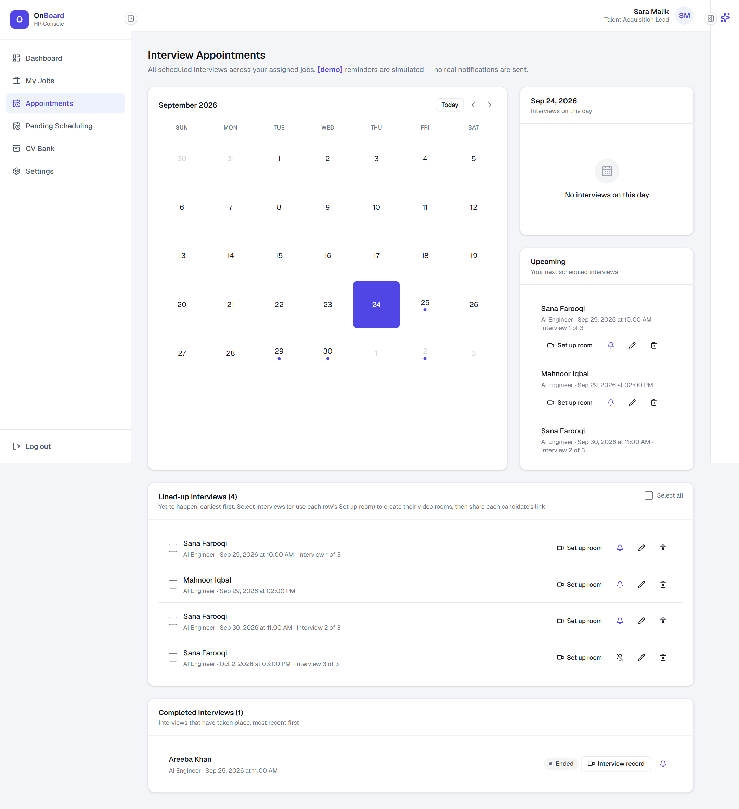

### Email and reminders — planned, not live yet

> **Not functional yet.** Today the reminder switch is stored and shown, but **no emails are sent**; the app labels reminders as simulated.

Email will be added on a **business domain** so messages come from the company, not a generic sender:

1. Verify the company domain with a transactional email provider (SPF, DKIM and DMARC records) and send from an address such as `hiring@company.com`.
2. Send **candidate invitations** containing the private interview link, a **reminder 24 hours before** every interview whose bell is on (a small scheduled job scanning appointments), and **decision emails** on accept / reject.
3. Send **account approval** emails to new HR members.

The data it needs already exists (candidate emails, the per-interview reminder flag, room links).

---

## 7. The HR agent

The **HR agent** is a chat assistant in a collapsible panel on every HR page. It can do what an HR can do in the app —
look things up, prepare things, and make changes — using the same rules as the buttons do.

<table>
<tr>
<td width="33%" valign="top">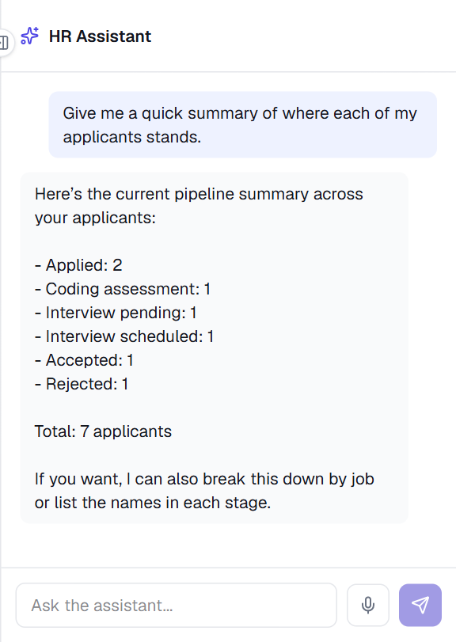<br><sub><b>Text answers</b> from live data.</sub></td>
<td width="33%" valign="top">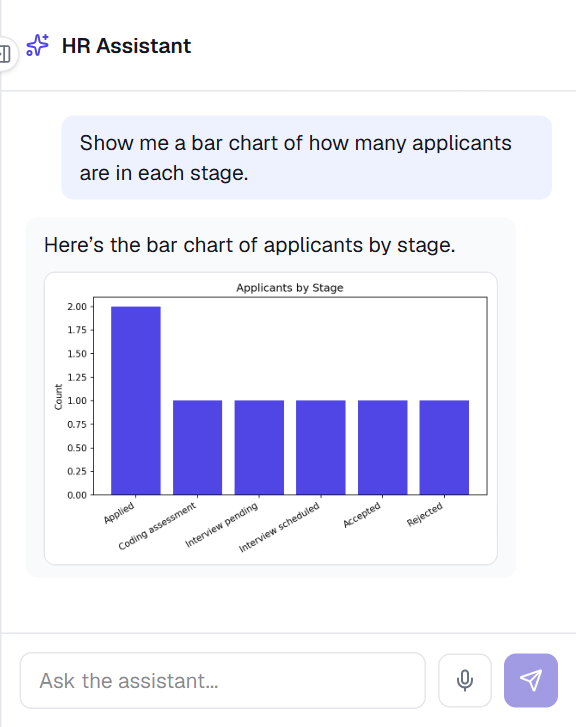<br><sub><b>Charts</b> drawn from real numbers.</sub></td>
<td width="33%" valign="top">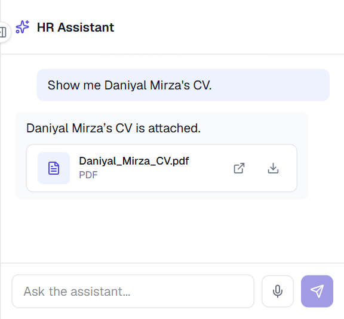<br><sub><b>Files</b> — CVs come back as PDFs you can open or download, not pasted text.</sub></td>
</tr>
<tr>
<td width="33%" valign="top">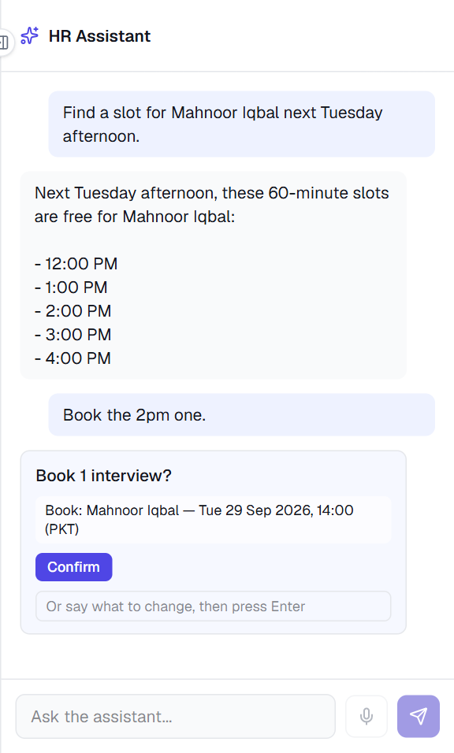<br><sub><b>Scheduling</b> — proposes free slots, then asks for one confirmation.</sub></td>
<td width="33%" valign="top">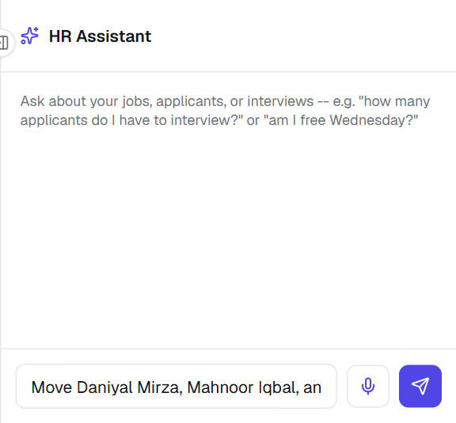<br><sub><b>Voice</b> — a spoken command, transcribed into the message box.</sub></td>
<td></td>
</tr>
</table>

### What it can do

| Area | Examples |
|---|---|
| **Look up** | Jobs, applicants and their stages, applicant details, GitHub / LinkedIn links, interview history and records, transcripts, the CV bank |
| **Show** | Candidate CVs and interview recordings as files; charts of pipeline data |
| **Rate & prepare** | HR ratings and notes, run AI reviews, generate AI interview questions, save interview notes and the post-interview review |
| **Move candidates** | Coding assessment, interview pending, **accept**, **reject** (with a note, optionally saving to the CV bank), rank applicants, delete |
| **Schedule** | Suggest free slots, **book / reschedule / cancel** interviews, set reminders |
| **Interview rooms** | Set up rooms and candidate links, switch recording on or off, enable live AI assistance before a call |
| **Jobs & settings** | Edit a job's details, auto-save rejected CVs |

It deliberately **cannot** create jobs or manage users (admin-only), delete a whole job (too destructive), start or end the live
video call, or touch another HR's data.

### How you talk to it

- **Type** a message, or
- **Speak**: press the microphone, say the command, and the transcript appears in the message box to check before sending. Transcription is done by OpenAI, so it works in any browser — and the speech model is primed with your own candidate and job names so names are spelled correctly.

### It asks before it changes anything important

Stage moves, accept / reject, bookings, cancellations, deletions and job edits show a **confirmation card**. When you ask for
several changes at once — "book all three on Tuesday morning" — they arrive on **one card**, not one per person, and even mixed
requests ("reject these two, book that one") share a single card. You can approve, or type what to change ("an hour later") and it will re-plan.

Times are understood in your own time zone. The conversation is remembered per HR, and a confirmation you leave unanswered
survives a page reload.

---

## 8. Live interview assistance

An optional mode where the AI listens to the interview and helps the interviewer go deeper — **only** when the interviewer
turns it on **before the call starts**.

<table>
<tr>
<td width="33%" valign="top">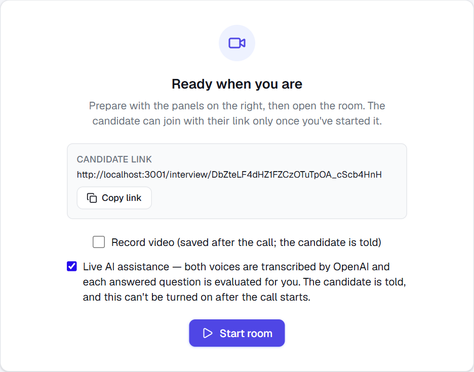<br><sub><b>1. Chosen before the call.</b> It can be switched off during the call, never on.</sub></td>
<td width="33%" valign="top">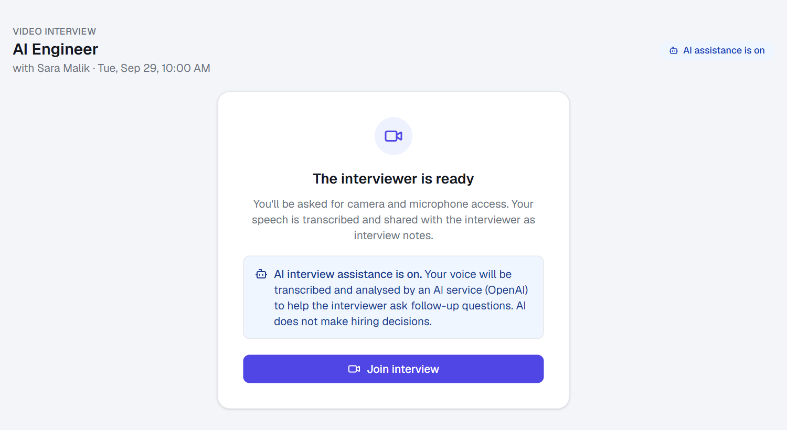<br><sub><b>2. The candidate is warned</b> on the waiting and join screens, and a banner stays visible during the call.</sub></td>
<td width="33%" valign="top">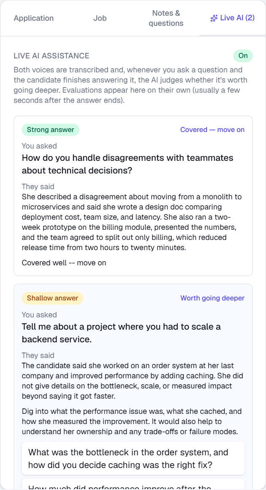<br><sub><b>3. Per-question insights</b> appear as answers finish.</sub></td>
</tr>
</table>

How it works:

1. Once the candidate is in the room, each browser sends short clips of **its own microphone** to the backend (cut at natural pauses), where OpenAI transcribes them. Because each side sends only its own voice, the speaker is always known.
2. In the background, a worker waits for a quiet moment and asks the model one question: *has the interviewer asked a question that the candidate has now fully answered?* Small talk and half-finished answers produce nothing.
3. For each answered question, the interviewer sees how **deep** the answer was (shallow / adequate / strong), whether it is **worth going deeper**, and up to two **follow-up questions** — or "covered, move on".
4. Insights are saved with the interview, so they show up on the interview record afterwards.

The transcript lags speech by a few seconds, and AI never makes a hiring decision — it only suggests what to ask.

---

## 9. AI features: candidate review and interview prep

### AI candidate review

One click runs a structured evaluation of a candidate: their CV and cover letter against the job description, plus their public
**GitHub** activity (and LinkedIn, when Bright Data is configured). The result is a score from 1 to 5 in **communication, job-description overlap, GitHub, LinkedIn and overall — each with written reasoning** that cites evidence. If GitHub or LinkedIn data isn't available, the score is marked "data unavailable" and the reasoning says it reflects missing data, not a judgement of the person.

It is a **recommendation only**: HR's own rating and ranking always come first.

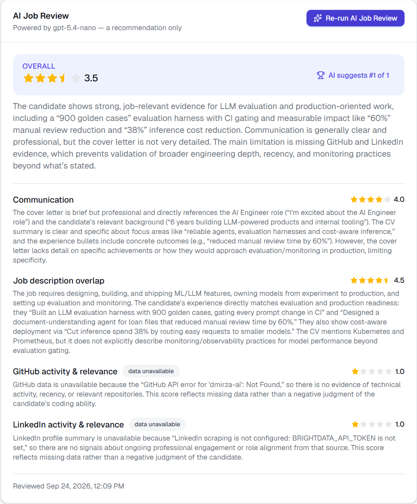

### AI interview prep (questions and notes)

Before an interview, HR can generate **8–12 tailored questions** built from the CV, the job description and the candidate's online profiles, written to sound like a natural conversation (an opener, questions grouped by story arc with the evidence behind each, and a closing). HR can steer them — "focus on NLP and evaluation" — and keep their own **notes** alongside; both are saved with the interview.

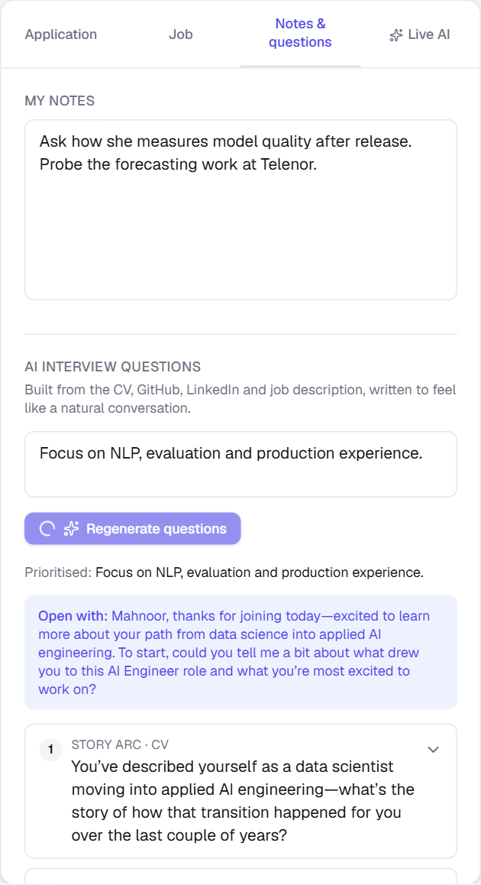

---

## 10. Technology: frameworks, models, databases

### Frameworks and libraries

| Layer | Technology |
|---|---|
| **Frontend** (Console + Careers portal) | Next.js 16, React 19, TypeScript 5, Tailwind CSS 4, lucide-react icons |
| **Video** | Agora RTC (Web SDK in both apps; the backend mints access tokens) |
| **Backend API** | Python 3.10, FastAPI, Uvicorn, Pydantic 2 / pydantic-settings |
| **Data access** | SQLAlchemy 2 (async) with asyncpg, Alembic migrations |
| **Auth** | JWT access + refresh tokens (PyJWT), bcrypt password hashing, role checks (admin / hr) |
| **Agent** | LangGraph (StateGraph, ToolNode, human-in-the-loop `interrupt`), LangChain OpenAI, LangGraph Postgres checkpointer |
| **Integrations** | OpenAI SDK, PyGithub (GitHub API), Bright Data SDK (LinkedIn, optional), pypdf (CV text extraction), matplotlib (agent charts) |

### AI models

Each task has its own model, set in `backend/.env` — swapping one is a config change, not a code change.

| Task | Default model |
|---|---|
| HR agent (chat, tool use) | `gpt-5.4` |
| AI candidate review · AI interview questions · "suggest a new topic" | `gpt-5.4-nano` |
| Live-interview answer analysis (per question) | `gpt-5.4-mini` |
| Speech-to-text: voice commands and live interview audio | `gpt-4o-mini-transcribe` |

Models that reject a `temperature` setting are handled automatically. Every call is logged in the AI usage panel.

### Databases and storage

| Store | Used for |
|---|---|
| **PostgreSQL** | Users and approvals, jobs, applicants, appointments, interview insights, the AI-usage log, and the **agent's conversation state** (LangGraph checkpoints) |
| **MinIO** (S3-compatible) | CV files, interview recordings, saved transcripts, agent charts — Postgres keeps only pointers |

### Design notes

- **One set of business rules.** The agent performs changes by calling the API's own functions, so it can never do something the UI would refuse (stage rules, slot overlap, ownership).
- **AI as a recommendation.** Scores, insights and agent plans are advisory; changes need confirmation and candidates are told when AI listens.
- **Blobs in object storage, pointers in the database.**

---

## 11. Getting started

Prerequisites: Python 3.10, Node.js 20+, PostgreSQL, MinIO, an OpenAI API key, and an Agora project (app id + certificate) for video.

```bash
# 1. Backend
cd backend
py -3.10 -m venv .venv
./.venv/Scripts/pip install -r requirements.txt       # Windows (use source .venv/bin/activate elsewhere)
cp .env.example .env                                   # fill in database, MinIO, JWT, OpenAI, Agora
./.venv/Scripts/python -m alembic upgrade head
./.venv/Scripts/python run.py                          # use run.py, not `uvicorn` directly (Windows event loop)

# 2. Console (admin + HR) — http://localhost:3000
cd frontend && npm install && npm run dev

# 3. Careers & interview portal — http://localhost:3001
cd apply-portal && npm install && npm run dev
```

- MinIO must be running before the API starts.
- Create the **first admin** with the demo seed (`python -m app.seed`, optional) or directly in the database; everyone else signs up and is approved by an admin.
- Optional keys: `GITHUB_TOKEN` (higher GitHub rate limit), `BRIGHTDATA_API_TOKEN` (LinkedIn data), `OPENAI_ADMIN_API_KEY` (account-wide usage on the admin panel).

See [`backend/README.md`](backend/README.md) for the full setup, environment variables and API layout.

---

## 12. Repository layout, videos and roadmap

```
frontend/      OnBoard Console — Next.js (Admin + HR), port 3000
apply-portal/  Careers & interview portal — Next.js (public), port 3001
backend/       FastAPI API, AI layer, LangGraph agent (backend/app/assistant/GRAPH.txt explains its design)
docs/          README images and the scripts that regenerate them
presentation/  Scripted product videos (Playwright) and their assets
TODO.txt       Living list of what's built, what's outstanding and recommendations
```

**Product videos** (recorded from the real app by the scripts in `presentation/`): onboarding a new HR member, job posting and
applications, the interview process from assessment to hire, and the AI features.

**Roadmap highlights** (see [`TODO.txt`](TODO.txt)): real email delivery on a business domain (section 6); a chat-history view and
new-chat button for the agent; an expected-pay field for the agent's pay statistics; per-item checkboxes on confirmation cards;
and a coding-assessment delivery flow.
